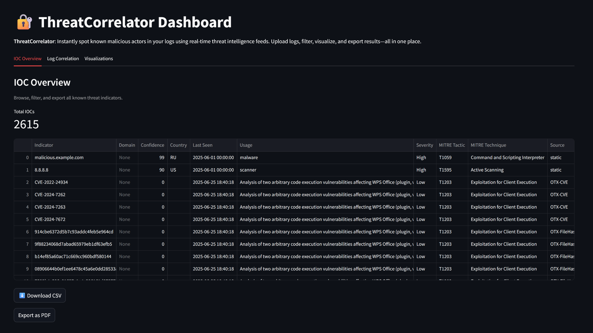
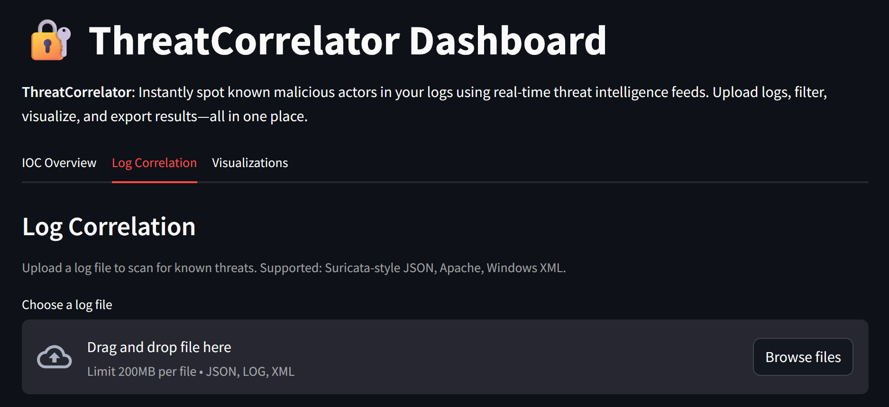
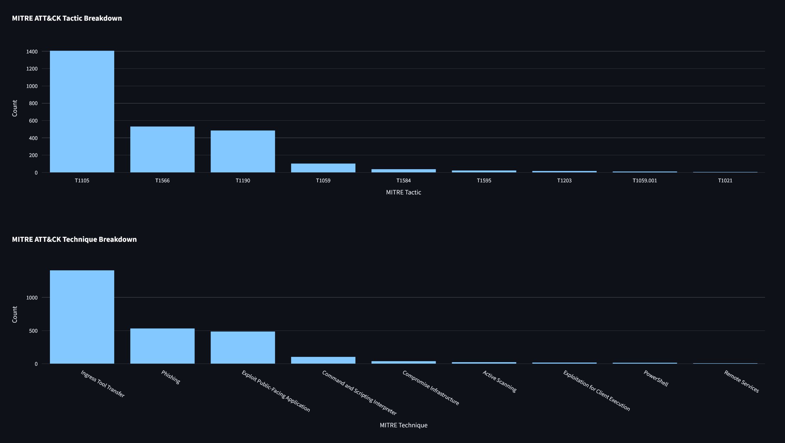

# ThreatCorrelator

[](https://github.com/AlexZimpher/threat-correlator/actions/workflows/ci.yml)


[](https://codecov.io/github/AlexZimpher/threat-correlator)

**Threat-Correlator** instantly spots known malicious actors in your logs by correlating them with real-time threat intelligence feeds. No security expertise required, just point it at your logs and get clear, actionable results.

---

## Why This Project?

This project was built to showcase my ability to design, implement, and document a robust, modular, and security-focused Python application. It demonstrates:

- Clean, modern Python (3.11+) with type hints and docstrings
- Secure handling of API keys and configuration
- Modular architecture and extensibility
- Real-world data parsing, enrichment, and correlation
- Clear, reader-friendly code and documentation

---

## Features

- **Multi-Source Threat Feeds:** Checks your logs against AbuseIPDB, AlienVault OTX, and more
- **IOC Correlation:** Finds both IP and domain matches in your logs
- **MITRE ATT&CK Mapping:** Tags each threat with a known tactic/technique for context
- **Severity & Country Context:** Flags critical threats and shows their origin
- **Interactive Dashboard:** Visualize, filter, and download results easily
- **CLI & API Ready:** Use from the command line or extend as a backend service

---

## Architecture & How It Works

```text
┌──────────────┐    ┌──────────────┐    ┌──────────────┐    ┌──────────────┐    ┌──────────────┐
│ Threat Feeds │ →  │   Database   │ →  │  Correlator  │ →  │  Enrichment  │ →  │  Dashboard   │
└──────────────┘    └──────────────┘    └──────────────┘    └──────────────┘    └──────────────┘
```

**Fetch Threat Feeds** → **Store in Local DB** → **Correlate with Your Logs** → **Enrich & Classify** → **Visualize & Export**

---

## Secure Configuration & API Keys

- **Never commit secrets:** All API keys and sensitive config must go in `config/config.local.yaml`, which is git-ignored by default.
- **Template provided:** Use `config/config.local.yaml.example` as a starting point for your local config.
- **Config merging:** The app loads `config/config.yaml` (base) and overlays `config/config.local.yaml` (secrets/overrides) securely at runtime.
- **See** `src/threatcorrelator/config_loader.py` **for details.**

---

## Dashboard Screenshots





---

## Example Use Case

- **Web Server Security:** Scan your Apache logs and instantly see if any visitors’ IPs are known malicious. Block and investigate as needed.

---

## Quick Start

```bash
poetry install
poetry run streamlit run src/threatcorrelator/dashboard.py
```

---

## Extending & Customizing

- Add new threat feeds by implementing a fetcher in `src/threatcorrelator/fetch.py`
- Add new enrichment logic in `src/threatcorrelator/enrichment.py`
- Adjust log parsing in `src/threatcorrelator/correlate.py`

---

## Technical Highlights

- **Security:** No secrets in code, robust error handling, safe defaults
- **Quality:** Linting, type hints, and clear docstrings throughout
- **Testing:** Pytest-based tests for core logic
- **Modern Stack:** Poetry, SQLAlchemy, Streamlit, Click, and more

---

**Author:** [Alexander Zimpher](https://github.com/AlexZimpher)
