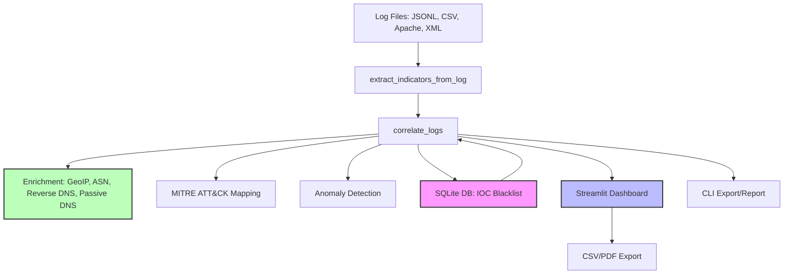

# ThreatCorrelator Architecture

```mermaid
graph TD
    A[Threat Feeds: AbuseIPDB, OTX, Static CSV] --> B[Fetcher]
    B --> C[Parser/Normalizer]
    C --> D[SQLite DB]
    D --> E[Correlator]
    E --> F[Dashboard (Streamlit)]
    E --> G[CLI]
    F --> H[Visualization/Export]
    G --> H
```

- **Feeds:** Multiple sources (API, CSV, etc.)
- **Fetcher:** Downloads and normalizes IOCs
- **DB:** Stores all indicators
- **Correlator:** Matches logs to IOCs, applies enrichment, anomaly detection
- **Dashboard/CLI:** User interfaces for analysis and export

## Architecture Diagram


